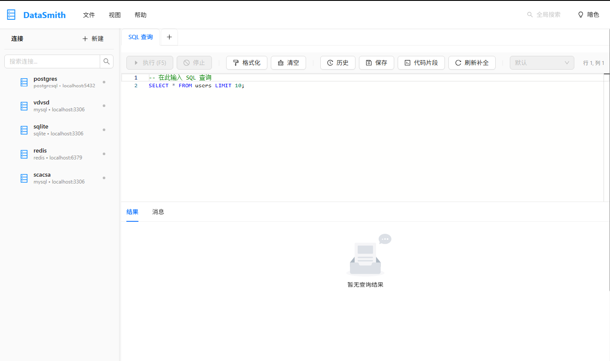
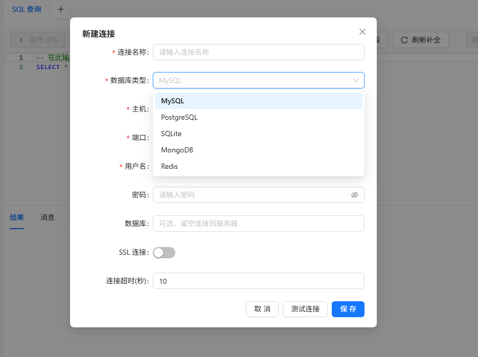
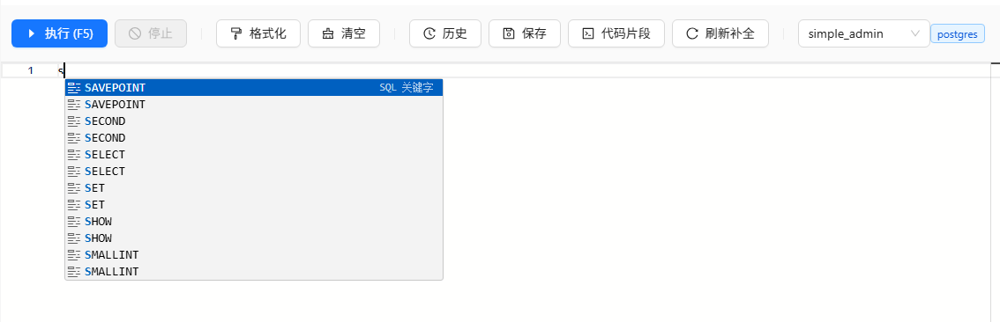

# DataSmith

轻量级数据库管理工具，基于 Tauri 2.x 构建。

## 功能特性

- **多数据库支持** - MySQL、PostgreSQL、SQLite、MongoDB、Redis
- **数据管理** - 表格数据查看、编辑、导入导出
- **SQL 编辑器** - Monaco 编辑器，支持语法高亮和自动补全
- **实用工具** - 数据对比、查询构建器、SQL 片段管理
- **安全存储** - 密码通过系统密钥环安全存储

## 截图预览

<!-- 截图占位符 -->
### 主界面



### 连接管理



### SQL 编辑器



## 技术栈

### 前端
- Vue 3 + TypeScript
- Pinia 状态管理
- Vue Router 路由
- Ant Design Vue UI 组件库
- Monaco Editor 代码编辑器

### 后端
- Rust
- Tauri 2.x
- SQLx (MySQL/PostgreSQL/SQLite)
- MongoDB Driver
- Redis Driver

## 快速开始

### 环境要求

- Node.js 18+
- Rust 1.70+
- pnpm 或 npm

### 安装依赖

```bash
# 安装前端依赖
npm install

# 或使用 pnpm
pnpm install
```

### 开发模式

```bash
# 启动前端开发服务器
npm run dev

# 启动完整 Tauri 应用（开发模式）
npm run tauri:dev
```

### 构建发布

```bash
# 构建前端
npm run build

# 构建生产版本
npm run tauri:build
```

## 项目结构

```
DataSmith/
├── src/                    # Vue 前端源码
│   ├── components/         # Vue 组件
│   │   ├── connection/     # 连接管理组件
│   │   ├── data/           # 数据展示组件
│   │   ├── database/       # 数据库操作组件
│   │   ├── editor/         # 编辑器组件
│   │   ├── search/         # 搜索组件
│   │   └── tools/          # 工具组件
│   ├── router/             # 路由配置
│   ├── services/           # 服务层
│   ├── stores/             # Pinia 状态管理
│   ├── types/              # TypeScript 类型定义
│   └── views/              # 页面视图
├── src-tauri/              # Rust 后端源码
│   ├── src/
│   │   ├── commands/       # Tauri 命令
│   │   ├── database/       # 数据库驱动实现
│   │   ├── models/         # 数据模型
│   │   └── utils/          # 工具函数
│   └── Cargo.toml          # Rust 依赖配置
└── package.json            # 前端依赖配置
```

## 支持的数据库

| 数据库 | 状态 | 功能 |
|--------|------|------|
| MySQL | 支持 | 连接管理、数据查询、表管理、导入导出 |
| PostgreSQL | 支持 | 连接管理、数据查询、表管理、导入导出 |
| SQLite | 支持 | 连接管理、数据查询、表管理、导入导出 |
| MongoDB | 支持 | 连接管理、文档操作、集合管理 |
| Redis | 支持 | 连接管理、键值操作、数据查看 |

## 开发指南

### 数据库驱动配置

数据库驱动通过 Cargo.toml 的 feature flags 控制：

```toml
[features]
default = ["mysql", "postgresql", "sqlite", "mongodb-support", "redis-support"]
mysql = ["sqlx"]
postgresql = ["sqlx", "deadpool-postgres"]
sqlite = ["sqlx"]
mongodb-support = ["mongodb"]
redis-support = ["redis"]
```

### 类型定义同步

前端 TypeScript 类型定义 (`src/types/database.ts`) 需要与后端 Rust 类型 (`src-tauri/src/database/traits.rs`) 保持同步。

## 许可证

GPL-3.0 License

## 贡献

欢迎提交 Issue 和 Pull Request！
